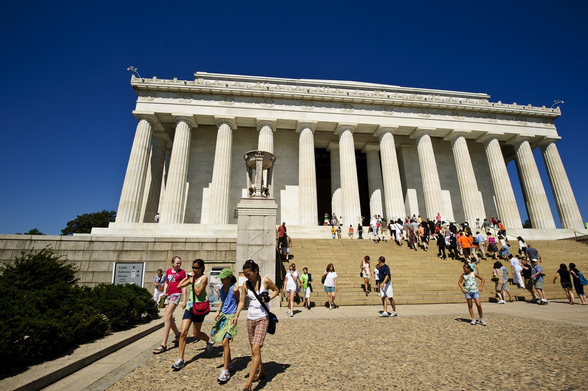
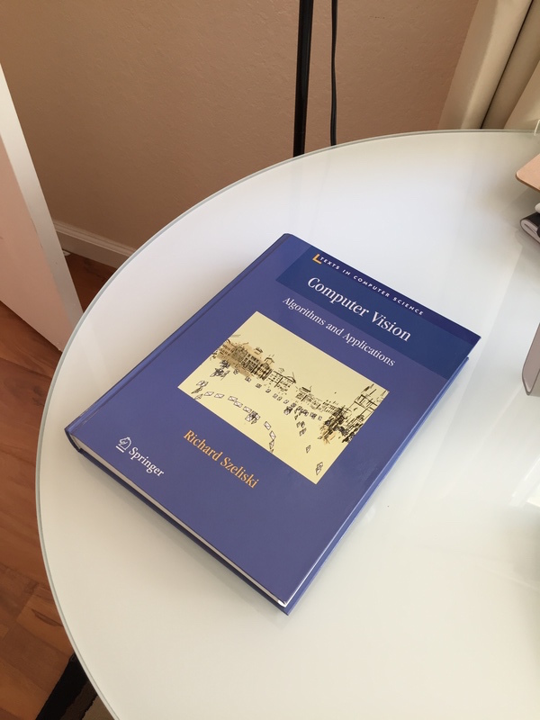
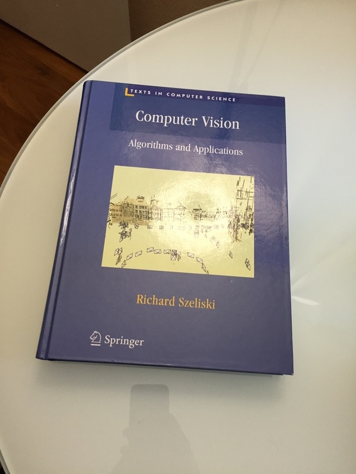

# A2 Report
# Part1: Given a set of Images , group them into k groups
## Proposed Solution
1. Compute the Similarity for all possible pair of images (step1) 
2. Get the similarity matrix from the previous matrix, pass the similarity matrix to the clustering algorithm (step2)
3. Compute the Pairwise metric (step3) 
### step1
- This is the first step where we extract the features from the images. We have used ORB feature to extract features from the image.
- Compute the distance between two images image1 and image 2 as follows:
    - For each feature1 in image1 , find the minimum distance & second minimum distance to all the features in the image2
    - If the ratio of the second minimum distance and minimum distance is greater than a threshold then increase the match count
    - Repeat this for all the features in the image1. This gives us a count. This count acts as the similarity between the image1 and image2
- Repeat the previous step for all the pairs of images
### step2
- Once we have the similarity matrix from the **step1** , pass it into the clustering algorithm
- Agglomerative clustering has been used with **k** groups. This sklearn library method accepts precomputed similarity matrix 
### step3
-  Once the labelling is done , compute the pairwise accuracy metric in the following 
    - For all the pairs , if the pair has same file name and belongs to the same cluster increase the **TruePositive count**
    - If the pair has different file namd and those two images belong to different clusters then increase the **TrueNegative count**
    - Ratio of the sum of TP, TN and all possible pairs count will give the pair wise accuracy  
## Experiments and Results
- Like any ML Problem, here also we have identified the hyperparameters in the pipeline
- We wanted to do **HyperParameter** Tuning using **Random Grid Search** method
- These are the **HyperParameters**
    - First one is the features dimension size of the ORB
    - Second one is the threshold ratio between the second min distance and minimum distance
    - Third is the way clustering is done. In the clustering, the way linkage is done whether it is 'average', 'single', 'complete'

<!-- TABLE_GENERATE_START -->

| NUM ORB FEAUTRES  | Threshold  | Clustering Param | Pairwise Accuracy |
| ----------------- | ---------- | ---------------- | ----------------- |
| 50                | 1.5        | single           |    25.89          |
| 20                | 1.8        | single           |    25.89          |
| 20                | 1.8        | average          |    25.89          |
| 100               | 1.1        | complete         |    82.51          |
| 100               | 1.1        | single.          |    26.36          |
| 100               | 1.1        | single.          |    26.36          |
| 200               | 1.2        | complete.        |    81.11          |
| 200               | 1.1        | complete.        |    82.70          |
| 300               | 1.5        | complete.        |    64.05          |
| 300               | 1.8        | complete.        |    25.89          |


<!-- TABLE_GENERATE_END -->

## Conclusions and Observations 


1. The above pictures is the visualization of feature matching of bigben and closseum. Our model placed these two images in the same cluster. This happened because the border around the clock in the bigben ressembled the holes in the walls of the closseum. We can see clearly from the feature matching. There is nothing wrong with the feature extraction, just that the extracted features are matched because of similarity. Even for a naked eye , if we look at the neighbourhood of the feature matches, we feel that the areas are similar. 
2. The best parameters for the dataset given occurred at these parameters: **Number of ORB features: 200, Threshold:1.1 or 1.2 ClusteringType:'Complete'**. On the dataset that was given , it produced a pairwise accuracy of **81+** percent
3. One thing that we observed is that the some of the clusters clearly not dominated by the single true class. Inspite of that the cluster pairwise metric has good accuracy due to the fact that the **TP** and **TN** are given equal weightage. Grouping the same class in same cluster is much difficult task than grouping the different classes into different clusters. Weightage to **TP** should be given more weightage than **TN**

# Part 2: Image Transformations

### Step 1: Bilinear interpolation

To begin with part 2, we first started working on the given matrix and the lincoln image. 

We want to solve the equation:
X_ = Transformation_matrix * X

where X_ is the destination image co-ordinates and X is the source image co-ordinates.

In this example, we are given the X_ co-ordinates and we need to find X. To do this, we first find the inverse of the transformation matrix. We then do inverse warping on the image to get the transformed image.

For inverse warping, we iterate over all pixels in the destination image (X_) and try to find it's pixel from the source image (X). To get the co-ordinates from the source image, we use dot product of inverse of transformation matrix and the co-ordinates of the destination image. The co-ordinates of the source image that we just found out might not be the exact pixel. For example, if we try to find the corresponding source image pixel for the destination pixel (0,0), we might not land on the exact pixel value and might land between 2 pixels. In that case, we need to find the value for the destination pixel using 4 neighbouring pixels of the source pixel that we mapped the destination pixel to. This is done using bilinear interpolation.

Let us assume, that for destination pixel (x,y) mapped source pixel is (a,b). The 4 neighboring pixels will be (x1,y1) (x1+1,y1), (x1,y1+1) and (x1+1,y1+1). Now, the value at destination pixel can be given as:

destination_image(x,y)=(1-a)* (1-b) * source_image(x1,y1) + a*(1-b)* source_image(x1+1,y1) + a* b* source_image(x1+1,y1+1) + (1-a)* b* source_image(x1,y1+1)

Once we iterate over all the pixels in the destination image and get the values of it from the source image, we get our transformed image.

Below is the input and output of our code for the lincoln.jpg image provided in the GitHub repo.




### Step 2: Finding transformation matrix, given transformation and corresponding points

The main step of part 2 is finding the transformation matrix, given the corresponding points between 2 images and the type of transformation between the images. 

We are given 4 types of transformations: translation, Euclidean, affine, and projective. Below is the logic of finding transformation matrix for each type of transformation.

1. Translation:

For finding the transformation matrix for translation, we need to find the translation in the x direction (tx) and y-direction (ty). This can be found by:

tx= destination_image(x)-source_image(x)
ty= destination_image(y)-source_image(y)

where,
destination_image(x) is the x co-ordinate of the destination image
destination_image(y) is the y co-ordinate of the destination image
source_image(x) is the x co-ordinate of the source image
source_image(y) is the y co-ordinate of the source image

Transformation matrix = [[1, 0, tx], <br>
                      [0, 1, ty], <br>
                      [0, 0, 1]] <br>
                      
2. Euclidean:

For this type of transformation, there are 2 points of correspondence. We use the equation:

AX=B

where, A= source image co-ordinates

A= [[source_pts[0][0], -source_pts[0][1], 1, 0], <br>
    [source_pts[0][1], source_pts[0][0], 0, 1], <br>
    [source_pts[1][0], -source_pts[1][1], 1, 0], <br>
    [source_pts[1][1], source_pts[1][0], 0, 1]] <br>
    
where source_pts is a 2-D matrix with first dimension giving the point of correspondence and second dimension giving the co-ordinate. It contains all points of source image whose matching points are given.
E.g: source_pts[1][0] is the x co-ordinate of the second point of correspondence.

B= [dest_pts[0][0], <br>
    dest_pts[0][1], <br>
    dest_pts[1][0], <br>
    dest_pts[1][1]]
    
 where dest_pts is a 2-D matrix just like source_pts but for destination image points.
 
X= transformation matrix which is to be found.

3. Affine:

For this type of transformation, there are 3 points of correspondence. We use the same equation as in Euclidean transformation but the values of A and B will be as follows:

A= [[source_pts[0][0], source_pts[0][1], 1, 0, 0, 0], <br>
    [0, 0, 0, source_pts[0][0], source_pts[0][1], 1], <br>
    [source_pts[1][0], source_pts[1][1], 1, 0, 0, 0], <br>
    [0, 0, 0, source_pts[1][0], source_pts[1][1], 1], <br>
    [source_pts[2][0], source_pts[2][1], 1, 0, 0, 0], <br>
    [0, 0, 0, source_pts[2][0], source_pts[2][1], 1]]
    
B= [dest_pts[0][0], <br>
    dest_pts[0][1], <br>
    dest_pts[1][0], <br>
    dest_pts[1][1], <br>
    dest_pts[2][0], <br>
    dest_pts[2][1]] <br>

4. Projective:

For this type of transformation, there are 4 points of correspondence. We use the same equation as in Euclidean transformation but the values of A and B will be as follows:

A=[source_pts[0][0], source_pts[0][1], 1, 0, 0, 0,-source_pts[0][0] * dest_pts[0][0],-source_pts[0][1]* dest_pts[0][0]], <br>
  [0, 0, 0, source_pts[0][0], source_pts[0][1], 1,-source_pts[0][0]* dest_pts[0][1],-source_pts[0][1]* dest_pts[0][1]], <br>
  [source_pts[1][0], source_pts[1][1], 1, 0, 0, 0,-source_pts[1][0]* dest_pts[1][0],-source_pts[1][1]* dest_pts[1][0]], <br>
  [0, 0, 0, source_pts[1][0], source_pts[1][1], 1,-source_pts[1][0]* dest_pts[1][1],-source_pts[1][1]* dest_pts[1][1]], <br>
  [source_pts[2][0], source_pts[2][1], 1, 0, 0, 0,-source_pts[2][0]* dest_pts[2][0],-source_pts[2][1]* dest_pts[2][0]], <br>
  [0, 0, 0, source_pts[2][0], source_pts[2][1], 1,-source_pts[2][0]* dest_pts[2][1],-source_pts[2][1]* dest_pts[2][1]], <br>
  [source_pts[3][0], source_pts[3][1], 1, 0, 0, 0,-source_pts[3][0]* dest_pts[3][0],-source_pts[3][1]* dest_pts[3][0]], <br>
  [0, 0, 0, source_pts[3][0], source_pts[3][1], 1,-source_pts[3][0]* dest_pts[3][1],-source_pts[3][1]* dest_pts[3][1]]]
  
B=[dest_pts[0][0], <br>
   dest_pts[0][1], <br>
   dest_pts[1][0], <br>
   dest_pts[1][1], <br>
   dest_pts[2][0], <br>
   dest_pts[2][1], <br>
   dest_pts[3][0], <br>
   dest_pts[3][1]]

After we get the matrix we use step 1 to get the transformed image.

The output of this part on given input of book images is as follows:


The transformation matrix that we got for this part is as follows:
[ 4.34043935e-01, -4.19622184e-01, 2.91709494e+02], <br>
 [ 1.46491654e-01, 4.41418278e-01, 1.61369294e+02], <br>
 [-3.62463336e-04, -9.14274844e-05, 1.00000000e+00]]
 
# Part 3 : Generate a Panorama - Given 2 images
## Proposed Solution :
1. Extract feature point for each image using ORB from cv2 library
2. Get best matches between the points between 2 images using a threshold (100) which best matches using Hamming distance
3. Run RANSAC for 100 iterations and develop hypothesis randomly - Chose 4 points randomly and develop a projective transformtive matrix which will be the current hypothesis
4. After RANSAC choose the best matrix that was developed and received the most votes
5. Using the selected matrix get the new corners of the image whoch will have img1 and img2 combined as a panorama
6. Combine the images
## Detailed Explanation :
### Step 1
- Using the ORB functionality implemented in the CV library, i extract 1000 best features/keypoints/descriptors for each image
### Step 2
- 1000 keypoints found using ORB in the previous step are now used to find the best matches of pairs of points between 2 images
- I have done best feature selecion in 3 different methods, these are:
    - METHOD 1: Choosing 1 best for each 1000 points in the image 1 that matches a point in image 2
    - METHOD 2: Use a threshold to choose which point combination are there between 2 images which are passed as input
    - METHOD 3: Use the input CV BFMatcher function to get the best matches between the points which were found using ORB
- Out of the above three methods mentioned the best method that seems to work is the method 2 where we can adjust the threshold based on the requirements and needs
- The best matches is found using hamming distance.
- We use 2 for loops to loop through all the points and try and match each point in 1st image with each point in the 2nd image and then use one of the above method to sort out/select the pair of matching points
### Step 3 & 4
- RANSAC is an algorithm whih helps in differentiating between inliers and outliers for each hypothesis
- Each hypothesis is developed based on the requirements. And here the requirement was to get a transformation matrix(projective) which can help is capabale of transforming 2nd image passed as input to the 1st image and generate a panorama from them.
- For each iteration of RANSAC i first generate hypothesis on which we need to do voting. So i select 4 pair of best matched points(which were found in the previous step) and get a projective matric from them. 
- Then after that we keep on generating projective matrix till we exhaust the remaining points and see if each matrix is close to the matrix found initially in the RANSAC step, if it is then then i increase the vote of the current hypothesis by one.
- At the end of each step if there was even one vote casted for the hypothesis then i attach it to the list 
- I run the RANSAC step for 100 iterations, due to the fact that the points were chosen at random.
- After RANSAC is done I select 1 best metric with the most casted votes.
### Step 5
- Now after getting the matrix we had to generate a canvas so that when we put both the image s on it no pixel would be lost.
- Since i was transforming the second image to fit the first image i get the corners of the 2nd image and do dot prduct with the matrix to get the new corners of the image which will be after image transformation.
- Using some weird calculations i get the new shape of the image that will be able to accomodate both the images
### Step 6
- After getting the new image dimensions i start to paint the picture starting with the 2nd image
- I move pixel by pixel and get the new pixel for each location and put the values of the original pixels at these new location and adjust the shift if the image moved into the negative coordinate system after transformation
- Then i move to putting the 1st image onto the canvas. Here while putting the values i check if a values exists and if it does then i am taking the average of the values and putting that instead.
- And we are done. I output the resultant numpy array as image with name passed as command line argument.

## Results:
### Positive results:
1. Test case 0 - The images used here are the image provided in pdf <br>
 +  = 
1. Test case 1 - The images used here are the image provided in pdf <br>
 +  = 
1. Test case 2 - The images used here are the image provided in pdf <br>
 +  = 
1. Test case 3 - The images used here are the image provided in pdf <br>
 +  = 

### Negative results:
1. Neg Test case 1 : The images used are the books images used in part 2 - This test case could have failed becuase of one of the following reasons - it could either be that the second image can completely be immersed in the image or there were very few matching points. When the algo fails it outputs the second image as the output. <br>
 +  = 

## Challenges
- The more pointe we selected from ORB the better were the results but it also increased the time taken for the scripts to run by a lot as we were selcting the best matching points in squared time.
- The threshold is a manual feature which can be tuned out in the future to bring in some automation
- Sometimes there were singular matrices which were being generated so i had to skip over them and move on to the next step
- The panorama images are generating some lines in them which can be weeded out in the future


## How To Run the Scripts:-
```
python3 a2.py part1 k images/*.jpg output.txt 
python3 a2.py part2 4 book2.jpg book1.jpg book_output.jpg 141,131 318,256 480,159 534,372 493,630 316,670 64,601 73,473
python3 a2.py part3 img1.png img2.png output.png
```

## Future Work
- Handling cases when images of different types are passed to create panoramas
- Try other feature matching techniques - other than ORB and SIFT
- Sometimes there were singular matrices which were being generated so i had to skip over them and move on to the next step
- The panorama images are generating some lines in them which can be weeded out in the future

## References
- Bilinear interpolation: https://youtu.be/UhGEtSdBwIQ
- Testing image of part 3 (Taj Mahal): https://github.com/samrudh/Panorama-Effect-Image-Stitching/tree/master/test_images 
